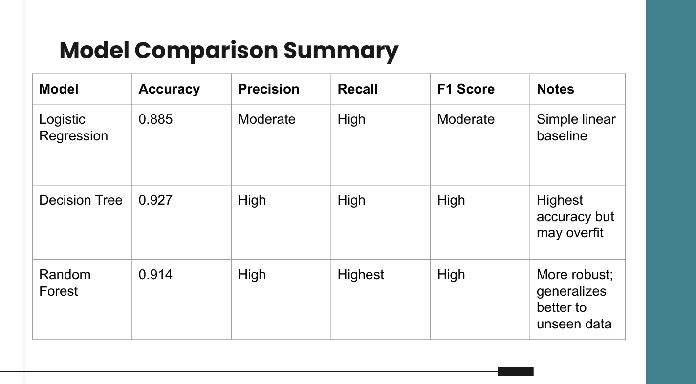
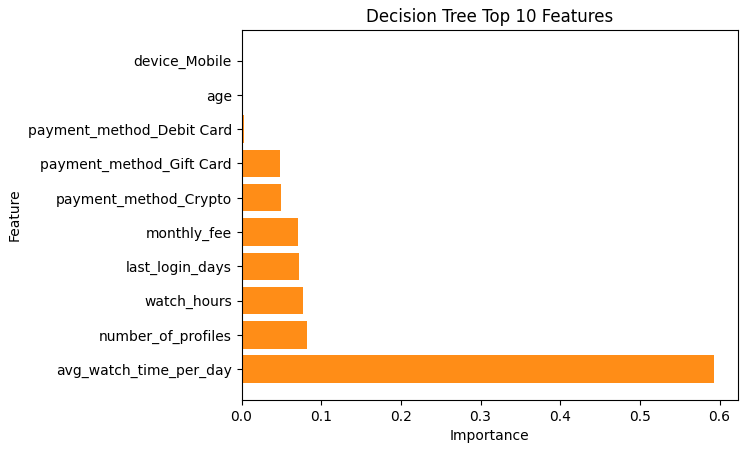

# Netflix Customer Churn Prediction

## Overview
This project analyzes a Netflix-style subscription dataset to predict customer churn and compare multiple classification models. The goal is to identify the strongest churn signals and translate the results into practical retention recommendations.

## Business Question
Which customers are most likely to churn, and what factors are most strongly associated with churn?

## Why This Matters
Churn reduces business revenue and growth. A churn prediction workflow can help teams proactively identify at-risk customers, prioritize retention efforts, and understand the behaviors that tend to lead to cancellation.

## Dataset
Netflix customer churn dataset from Kaggle (synthetic/educational).

Example features:
- **Engagement:** watch hours/month, average watch time/day, last login
- **Subscription:** plan type, monthly revenue
- **Demographics:** age, gender

## Approach
### Models Compared
- Logistic Regression
- Decision Tree
- Random Forest

### Evaluation
- Train/test split
- Performance metrics: Accuracy, Precision, Recall, F1-score
- Confusion matrix
- **Cross-validation was incorporated after feedback** and is treated as the final evaluation approach in this repo.

## Key Results
### Decision Tree Confusion Matrix (Cross-Validated)
From the final cross-validated evaluation:

- **True Negatives:** 490  
- **False Positives:** 7  
- **False Negatives:** 14  
- **True Positives:** 489  

**Interpretation:**
- The model correctly identified **490 non-churners** and **489 churners**
- It raised **7 false alarms** (predicted churn when they didn’t churn)
- It missed **14 churners** (predicted they wouldn’t churn but they did)

## Key Insights
- Engagement variables tended to be the strongest signals of churn (e.g., lower watch time and longer inactivity).
- Tree-based models performed strongly for classification and interpretability.
- The Decision Tree was selected as the best-performing model based on F1-score, which we used as the primary metric for model comparison.

## Recommendations
- Use engagement metrics as an early warning signal to identify at-risk customers
- Target low-engagement users with personalized content recommendations, reminders, or retention incentives
- Promote family plans to increase long-term retention and reduce churn risk
- Deploy the Random Forest model for ongoing churn monitoring and prediction

## Key Visuals
### Model Performance Comparison

### Decision Tree Confusion Matrix (Cross-Validated)

### Top Predictors / Feature Importance (Tree Model)

## About (Group Project)
This was a group project completed during my MSBA program at UC Irvine. I contributed primarily to interpreting model performance (precision/recall/F1 and confusion matrices), summarizing churn drivers, and developing the final report and presentation narrative.

## Repository Structure
- `netflix_churn_modeling.ipynb` - notebook with full workflow (team-developed)
- `images/` - visuals used in this README
- `slides/` - final presentation deck
- `report/` - final written report

---

## Files
- `netflix_churn_modeling.ipynb`
- `slides/netflix_churn_presentation.pdf`
- `report/netflix_churn_report.pdf`
